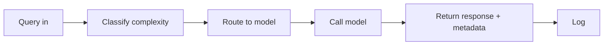

# LLM Cost Autopilot - PRD

2026-09-17&#32;

## Problem Statement

Most teams route every LLM request to the same flagship model regardless of task complexity, overpaying for simple requests a cheaper model could handle equally well. This system analyzes each incoming query's complexity and routes it to the cheapest model capable of handling it at acceptable quality — closing the gap between routing mechanics, which are well understood and widely built, and routing correctness, which most existing tools still skip.

## Request Flow

1. **Query in** — raw prompt hits the ingestion endpoint; capture context length and any explicit user hints.
2. **Classify complexity** — LLM-as-classifier approach: one cheap, fast call (e.g. to Haiku) rates the prompt's complexity. Chosen over a trained sklearn classifier for build speed — no labeled training data needed.
3. **Route to model** — complexity tier maps to a model via a config lookup (e.g. simple → Haiku, medium → Sonnet, hard → Opus), with hand-written override rules for classifier blind spots (e.g. any prompt containing code is bumped to at least medium tier).
4. **Call model** — unified abstraction layer sends the request to the chosen model; captures response text, tokens in/out, latency, and actual cost.
5. **Return response + metadata** — user gets the answer (data) plus routing metadata: model used, complexity tier, cost vs. baseline.
6. **Log** — full trace (query → complexity score → model chosen → cost) written to SQLite/JSON; powers the savings ticker and audit trail.

Validation (shadow-checking the routing decision against a higher-tier model) is explicitly not part of this flow — see Out of Scope.

## Tech Stack

Final stack to be confirmed based on team and infrastructure preferences. Directionally:

For v1, the interface is a chat UI. The routing engine itself is built as a decoupled service, not baked into the chat frontend — any application (e.g. a template creator, a support tool) could call it directly for routing decisions, with the chat UI acting as one client among possible others.

| Component | Candidate | Notes |
| --- | --- | --- |
| Backend | Python, FastAPI | async-native, standard for this kind of service |
| LLM providers | OpenAI, Anthropic | at least two, for real routing choices |
| Classifier | LLM-as-classifier (cheap model call) | see Request Flow — chosen over trained classifier for build speed |
| Logging | SQLite or structured JSON | audit trail per request |
| Frontend | Chat interface (v1) | needs to support the expandable per-message routing strip and savings ticker |

## Scope — In v1

- Unified model interface abstracting provider-specific calls (at minimum two providers, e.g. OpenAI + Anthropic)
- LLM-as-classifier for complexity scoring (simple / medium / hard)
- Config-based routing with at least one hand-written override rule
- Chat UI with per-message expandable routing strip (model, complexity badge, cost vs. baseline, one-line reason)
- Persistent running savings ticker
- Full request logging (query, complexity score, model, cost, latency)
- A three-prompt walkthrough illustrating routing behavior across complexity tiers

## Out of Scope / Future Work

- **Shadow-check validation** — sampling a percentage of requests, calling a higher-tier model in parallel, and scoring both with an LLM judge --> Deferred for the initial release because it reduces savings proportional to the sample rate and adds meaningful engineering surface (parallel calls, judge scoring, comparison logic).&#32;
